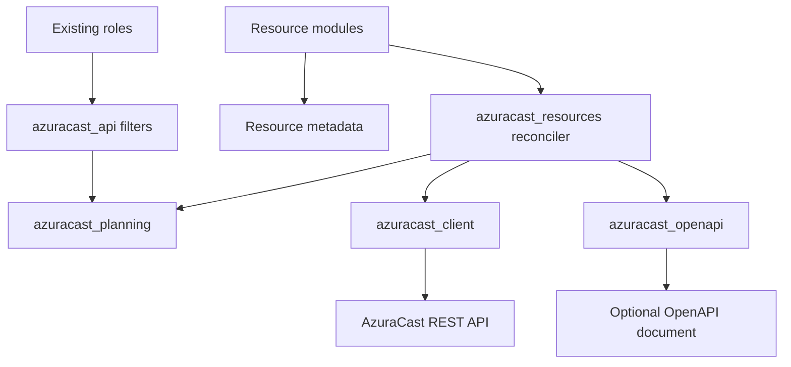

# feat: Expand AzuraCast Module Architecture

## Summary

Promote the current `storage_location` proof of concept into a reusable custom
module architecture for AzuraCast resources. The plan keeps roles as the
high-level convergence interface, extracts common module behavior into
`plugins/module_utils/`, and adds modules incrementally only where they improve
clarity, return values, and testing.

---

## Problem Frame

The collection currently has strong role/filter-based reconciliation, but direct
resource-level use is awkward because users must either adopt whole roles or
write their own `ansible.builtin.uri` tasks. The `storage_location` proof of
concept shows that custom modules can provide native `changed` status, readable
diff output, check-mode behavior, and safer sensitive-field handling without
discarding the existing role model.

The next risk is uncontrolled copying: adding more modules by duplicating
`storage_location.py` would move complexity from YAML into Python without
building a stable architecture. This plan makes the architecture explicit before
expanding the module surface.

---

## Requirements

- R1. Preserve the existing role interface as the supported whole-instance
  convergence API.
- R2. Provide resource-level modules for users who want direct Ansible tasks
  with native changed status, diffs, and structured return values.
- R3. Share idempotency, normalization, sensitive-field handling, and HTTP
  behavior between filters, roles, and modules rather than duplicating logic.
- R4. Treat each AzuraCast instance's `/api/openapi.yml` as capability
  discovery and validation input, not as blind code generation.
- R5. Keep normal convergence from resending write-only credentials; credential
  rotation remains explicit and separately censored.
- R6. Support collection-local unit, documentation, sanity, build, and example
  playbook smoke tests before any consumer-repo smoke test.
- R7. Add modules incrementally using criteria from `docs/module-feasibility.md`;
  do not rewrite all roles or all resource families in one step.
- R8. Document the module architecture and public module usage once the module
  contracts are stable enough for users.
- R9. Never require `git push` as part of this plan's implementation or
  verification.

---

## Scope Boundaries

- Do not replace the role variable model as the primary high-level interface.
- Do not rewrite all existing roles to modules in the first implementation pass.
- Do not add live production OpenAPI fetching to unit tests; use saved fixtures.
- Do not make OpenAPI generate module code or public arguments automatically.
- Do not make normal create/update paths rotate write-only credentials after a
  resource already exists.
- Do not edit the consumer `azuracast` repo during routine collection
  development.
- Do not run `git push`; committing and publishing are separate user-directed
  actions.

### Deferred to Follow-Up Work

- Full consumer-repo integration smoke testing: run only after collection-local
  verification is green and the user explicitly asks for consumer integration.
- Additional station-scoped modules beyond the first representative family:
  defer until the shared station-resource architecture is proven.
- README examples for every future module: add after each module's interface is
  stable, not ahead of implementation.

---

## Context & Research

### Relevant Code and Patterns

- `plugins/modules/storage_location.py`: current proof-of-concept module with
  present/absent, check mode, sanitized diff output, sensitive payload split,
  and optional OpenAPI contract validation.
- `plugins/module_utils/azuracast_client.py`: shared JSON HTTP client using
  Ansible URL utilities and API-key headers.
- `plugins/module_utils/azuracast_openapi.py`: OpenAPI capability reader for
  endpoint/method checks, request fields, read-only/write-only fields, required
  fields, enum values, `$ref`, and `allOf`.
- `plugins/module_utils/azuracast_planning.py`: shared normalization, desired
  shape, sensitive-shape, destructive-delete, storage-reference, and station
  resource planning helpers.
- `plugins/filter/azuracast_api.py`: compatibility layer that exposes existing
  filter names while translating planning exceptions into `AnsibleFilterError`.
- `roles/storage/tasks/main.yml`: current role behavior for storage planning,
  credential rotation, and destructive deletes.
- `roles/station_resources/tasks/main.yml`: existing station-scoped planning and
  family metadata for mounts, playlists, remotes, and webhooks.
- `examples/storage_location.yml`: collection-local smoke playbook using the
  module by FQCN.

### Institutional Learnings

- `docs/module-feasibility.md` recommends a hybrid module direction: keep roles
  primary, prove one module first, then expand resource-by-resource.
- `docs/api-authority.md` establishes the live AzuraCast OpenAPI document as
  the contract authority and keeps credential rotation explicit.
- `docs/superpowers/plans/2026-05-09-storage-location-module.md` records the
  completed proof-of-concept slices and remaining architecture work.

### External References

- Ansible collection structure docs: collection plugins, roles, tests, docs, and
  `galaxy.yml` live in standard collection directories; plugin documentation
  remains embedded in module docstrings.
- Ansible module utility docs: shared module code belongs in `module_utils/`,
  and collection imports should use the FQCN `ansible_collections` convention.
- Ansible sanity import docs: collection modules and module utilities should
  avoid unchecked non-stdlib imports unless handled explicitly for sanity tests.

---

## Key Technical Decisions

- Keep modules resource-level and roles orchestration-level: modules manage one
  resource or one scoped resource at a time, while roles continue to coordinate
  whole-instance desired state.
- Add a shared resource reconciler instead of copying `apply_storage_location`
  into each module. The reconciler should own present/absent, check mode, diff,
  before/after, sensitive comparison, and mutation dispatch.
- Keep resource declarations explicit Python metadata, not generated code. The
  metadata should describe stable key fields, endpoint paths, supported methods,
  read/write payload behavior, and optional scope fields.
- Use OpenAPI as a validator and capability guard. It can reject unsupported
  endpoints, methods, fields, read-only payloads, missing required fields, and
  invalid enums; it should not invent module argument specs or choose resource
  semantics.
- Continue splitting `resource` and `sensitive_resource`. Create can include
  sensitive fields when needed; normal update should send comparable safe fields
  only. Credential rotation remains a separate path.
- Prefer explicit modules for public UX when resource concepts are distinct,
  even if they share a private reconciler. For station-scoped resources, the
  plan should first prove one family before deciding between one generic
  `station_resource` module and separate public modules.
- Add README documentation after the architecture contracts are stable enough to
  describe without churn. README is allowed in this plan, but it should not lead
  the implementation.

---

## Open Questions

### Resolved During Planning

- Should README updates be allowed? Yes. The user explicitly allowed README
  edits, so documentation work may include README changes once interfaces are
  stable.
- Should the consumer repo be part of routine verification? No. Routine
  verification stays in the collection repo; consumer integration is a final
  smoke path by explicit request.
- Should the plan include `git push`? No. The user explicitly said never to
  push.

### Deferred to Implementation

- Exact helper names and class boundaries inside the shared reconciler: choose
  after writing the first tests and seeing which shape keeps modules simple.
- Whether station-scoped resources should become one generic public module or
  separate public modules: decide after implementing one representative family
  against the shared architecture.
- Whether OpenAPI fixtures should be generated from a real AzuraCast instance or
  hand-curated: decide after checking fixture maintenance cost during
  implementation.

---

## Output Structure

    plugins/
      module_utils/
        azuracast_client.py
        azuracast_openapi.py
        azuracast_planning.py
        azuracast_resources.py
      modules/
        storage_location.py
        station.py
        station_mount.py
    tests/
      fixtures/
        storage_locations_openapi.yml
        stations_openapi.yml
        station_mounts_openapi.yml
      test_azuracast_client.py
      test_azuracast_openapi.py
      test_azuracast_resources.py
      test_storage_location_module.py
      test_station_module.py
      test_station_mount_module.py
    examples/
      storage_location.yml
      station.yml
      station_mount.yml
    docs/
      module-feasibility.md
      module-architecture.md
      plans/
        2026-05-09-001-feat-module-architecture-plan.md
    README.md

This tree is directional. The implementation may adjust filenames if tests show
a clearer split, but the architecture should still separate transport,
contract/capability validation, planning/reconciliation, and public module
entry points.

---

## High-Level Technical Design

> *This illustrates the intended approach and is directional guidance for
> review, not implementation specification. The implementing agent should treat
> it as context, not code to reproduce.*

Modules should stay thin:

- parse Ansible parameters and documentation;
- build safe and sensitive desired payloads;
- provide resource metadata to the shared reconciler;
- translate API/planning failures into `fail_json`;
- return the shared result shape.

The shared reconciler should own repeated behavior:

- fetch live resources;
- locate one resource by stable key;
- validate OpenAPI capabilities when a contract is provided;
- compare desired safe shape to live desired shape;
- choose create, update, delete, or noop;
- honor check mode;
- redact returned resources and diffs;
- keep sensitive payloads out of normal update comparisons.

---

## Implementation Units

### U1. Define Shared Resource Contracts

**Goal:** Introduce a private module utility that describes AzuraCast resource
metadata and the common result contract without changing module behavior yet.

**Requirements:** R2, R3, R4, R5

**Dependencies:** None

**Files:**
- Create: `plugins/module_utils/azuracast_resources.py`
- Test: `tests/test_azuracast_resources.py`
- Modify: `docs/module-architecture.md`

**Approach:**
- Define the minimal metadata a resource module needs: collection path, item
  path, stable key, resource family name, create/update/delete method support,
  and optional scope fields.
- Define the standard result shape for all resource modules:
  `changed`, `action`, `before`, `after`, optional `diff`, and `resource`.
- Keep the contract independent from Ansible module objects so it is easy to
  unit-test with fake clients.
- Document which return values are safe and which values must be redacted.

**Execution note:** Implement new resource-contract behavior test-first.

**Patterns to follow:**
- `plugins/modules/storage_location.py` for current result shape.
- `plugins/module_utils/azuracast_planning.py` for pure helper style.
- `tests/test_storage_location_module.py` for fake-client tests.

**Test scenarios:**
- Happy path: a resource contract with collection/item paths and a stable key
  can describe storage locations without importing Ansible runtime objects.
- Error path: a contract missing required metadata fails with a clear planning
  error before any API mutation is possible.
- Edge case: a contract can represent a singleton or scoped resource without
  forcing storage-specific fields into the generic layer.
- Integration: existing storage-location behavior can be represented by the new
  metadata without changing public module parameters.

**Verification:**
- The new utility has focused unit coverage.
- No public module behavior changes in this unit.
- Existing filter and storage module tests still pass.

---

### U2. Build a Shared Resource Reconciler

**Goal:** Move common present/absent planning and mutation behavior into a
private reconciler used by modules.

**Requirements:** R2, R3, R5, R6

**Dependencies:** U1

**Files:**
- Modify: `plugins/module_utils/azuracast_resources.py`
- Test: `tests/test_azuracast_resources.py`

**Approach:**
- Implement one-resource reconciliation against a fake client:
  live-list lookup by stable key, desired safe comparison, create, update,
  delete, noop, check mode, and redacted result shaping.
- Keep destructive authority at the role layer for bulk unmanaged deletes. A
  module-level `state: absent` is explicit user intent for one resource.
- Keep sensitive update behavior conservative: create may use full desired
  payload, normal update uses safe comparable payload, and separate credential
  rotation remains outside the generic reconciler unless explicitly designed.
- Make failure paths deterministic and testable through
  `AzuraCastPlanningError`.

**Execution note:** Implement reconciler behavior test-first with a fake client.

**Patterns to follow:**
- `apply_storage_location` in `plugins/modules/storage_location.py`.
- `azuracast_compare_shape`, `azuracast_desired_shape`, and
  `azuracast_redact` in `plugins/module_utils/azuracast_planning.py`.

**Test scenarios:**
- Happy path: missing live resource produces `changed: true`, `action: create`,
  `before: null`, safe `after`, and calls create with expected payload.
- Happy path: changed live resource produces update with safe comparable payload
  only.
- Happy path: matching live resource produces noop and no mutation.
- Happy path: absent missing resource produces noop.
- Happy path: absent existing resource deletes only that resource.
- Edge case: check mode reports create/update/delete without calling mutation
  methods.
- Error path: duplicate live keys fail before mutation.
- Error path: live resource missing the stable key fails before mutation.
- Error path: sensitive fields never appear in diff output.

**Verification:**
- The reconciler tests cover every action branch.
- Existing `storage_location` tests still pass before refactoring the module.

---

### U3. Generalize OpenAPI Capability Validation

**Goal:** Move storage-specific OpenAPI validation into a reusable contract
validator that any resource module can call.

**Requirements:** R3, R4, R6

**Dependencies:** U1

**Files:**
- Modify: `plugins/module_utils/azuracast_openapi.py`
- Modify: `plugins/module_utils/azuracast_resources.py`
- Test: `tests/test_azuracast_openapi.py`
- Test: `tests/test_azuracast_resources.py`
- Add fixtures as needed under `tests/fixtures/`

**Approach:**
- Keep `OpenApiCapabilities` focused on reading OpenAPI structure.
- Add validation orchestration in the resource layer: required endpoint methods,
  declared request fields, read-only field rejection, required field checks,
  enum checks, and readable error messages.
- Support the schema features observed in saved fixtures first. `$ref` and
  `allOf` are already covered; add `oneOf`, `anyOf`, `nullable`, or nested
  object support only when a saved AzuraCast fixture requires it.
- Ensure unchecked imports remain compatible with `ansible-test sanity`.

**Execution note:** Add fixture-backed tests before expanding OpenAPI parsing.

**Patterns to follow:**
- `tests/fixtures/storage_locations_openapi.yml`.
- `tests/test_azuracast_openapi.py`.
- `validate_storage_location_openapi` in `plugins/modules/storage_location.py`
  as behavior to preserve but move out of the module.

**Test scenarios:**
- Happy path: storage-location contract validation accepts declared safe and
  write-only fields.
- Happy path: composed schemas expose fields, required metadata, enums,
  read-only fields, and write-only fields.
- Error path: missing endpoint or method fails before live resource fetch.
- Error path: undeclared payload field fails before mutation.
- Error path: read-only payload field fails before mutation.
- Error path: missing required field fails before mutation.
- Error path: invalid enum value fails before mutation.
- Edge case: absent state validates only read/delete capabilities needed for the
  action.

**Verification:**
- Storage-specific OpenAPI validation can be removed from
  `storage_location.py` without losing test coverage.
- OpenAPI tests remain fixture-only and do not contact production.

---

### U4. Refactor `storage_location` onto the Shared Architecture

**Goal:** Convert the proof-of-concept module into the first consumer of the
shared resource contracts, reconciler, client, and OpenAPI validator.

**Requirements:** R2, R3, R4, R5, R6

**Dependencies:** U1, U2, U3

**Files:**
- Modify: `plugins/modules/storage_location.py`
- Modify: `plugins/module_utils/azuracast_client.py`
- Modify: `plugins/module_utils/azuracast_resources.py`
- Test: `tests/test_storage_location_module.py`
- Test: `tests/test_azuracast_resources.py`
- Test: `examples/storage_location.yml`

**Approach:**
- Keep public module options stable: `base_url`, `api_key`, `type`,
  `resource`, `sensitive_resource`, `openapi_contract`, `state`,
  `validate_certs`, and `timeout`.
- Preserve current return shape and sanitized diff behavior.
- Replace storage-specific apply/validation internals with calls to shared
  utilities.
- Keep fallback local imports working for direct pytest imports, while FQCN
  imports remain the production collection path.
- Avoid broad cleanup in unrelated filters or roles.

**Execution note:** Refactor under existing storage module tests, adding only
regression tests for behavior that would otherwise be lost.

**Patterns to follow:**
- Existing `tests/test_storage_location_module.py` branch coverage.
- `plugins/filter/azuracast_api.py` fallback import pattern.

**Test scenarios:**
- Happy path: all existing storage present/absent/check-mode tests still pass.
- Happy path: OpenAPI contract validation still allows declared safe and
  sensitive fields.
- Edge case: normal update still omits sensitive fields.
- Error path: OpenAPI validation errors still include actionable field names.
- Integration: example playbook syntax-check resolves the packaged FQCN after a
  temporary collection install.

**Verification:**
- `storage_location.py` becomes a thin public module wrapper.
- Existing storage behavior and docs are unchanged from a user perspective.

---

### U5. Harden the Shared HTTP Client for Multiple Modules

**Goal:** Expand `AzuraCastClient` from storage-only helper methods into a
module-safe client that can support stations and station resources without
duplicating endpoint code.

**Requirements:** R2, R3, R6

**Dependencies:** U1, U2

**Files:**
- Modify: `plugins/module_utils/azuracast_client.py`
- Test: `tests/test_azuracast_client.py`

**Approach:**
- Keep the existing low-level `request` behavior and tests.
- Add generic list/create/update/delete helpers that take paths from resource
  metadata.
- Keep endpoint-specific convenience methods only where they materially improve
  clarity.
- Ensure errors include enough context for module `fail_json` without leaking
  API keys or sensitive payloads.
- Keep transport based on Ansible's URL utility rather than introducing an
  external HTTP dependency.

**Execution note:** Add client tests before adding helper behavior.

**Patterns to follow:**
- Current `AzuraCastClient.request` tests.
- Ansible sanity import constraints for module utilities.

**Test scenarios:**
- Happy path: generic create/update/delete helpers call the expected method,
  path, JSON body, headers, timeout, and TLS validation settings.
- Happy path: empty response body returns an empty dict.
- Error path: HTTP errors include status and response body but not credentials.
- Error path: URL errors are wrapped as `AzuraCastApiError`.
- Edge case: path templates can be filled with station/resource IDs without
  corrupting slashes.

**Verification:**
- New modules can use generic client helpers without adding raw `open_url`
  calls.
- Existing storage client tests remain valid.

---

### U6. Add an Admin-Level `station` Module

**Goal:** Prove the shared architecture on a second module with storage
reference resolution and a different stable key, without entering
station-scoped child resources yet.

**Requirements:** R2, R3, R4, R6, R7

**Dependencies:** U1, U2, U3, U5

**Files:**
- Create: `plugins/modules/station.py`
- Create: `tests/test_station_module.py`
- Create: `tests/fixtures/stations_openapi.yml`
- Create: `examples/station.yml`
- Modify: `plugins/module_utils/azuracast_client.py`
- Modify: `plugins/module_utils/azuracast_resources.py`
- Modify: `plugins/module_utils/azuracast_planning.py` only if storage
  reference behavior needs a generic helper adjustment.

**Approach:**
- Manage one station matched by `short_name`.
- Accept `resource` and `sensitive_resource` payloads like
  `storage_location`.
- Resolve storage reference objects such as `{type: station_media}` to live
  storage IDs before sending create/update payloads.
- Exclude station-scoped nested resources (`mounts`, `playlists`, `remotes`,
  `webhooks`) from station create/update payloads, matching existing role
  behavior.
- Keep station-scoped resources managed by roles until a separate module family
  is designed.

**Execution note:** Implement module behavior test-first with fake clients and
saved OpenAPI fixtures.

**Patterns to follow:**
- `plugins/module_utils/azuracast_planning.py` storage-reference and station API
  payload helpers.
- `roles/stations/tasks/main.yml` for current endpoint behavior and role
  expectations.
- `tests/test_azuracast_api_filters.py` storage-reference coverage.

**Test scenarios:**
- Happy path: matching live station by `short_name` noops.
- Happy path: missing station creates using desired safe payload.
- Happy path: changed station updates using desired safe payload.
- Happy path: `state: absent` deletes one station by ID when it exists.
- Edge case: check mode reports create/update/delete without mutation.
- Edge case: station-scoped child arrays are omitted from API payloads.
- Integration: storage reference objects are resolved to live storage IDs before
  mutation.
- Error path: unknown storage reference type fails before mutation.
- Error path: missing live storage ID fails before mutation.
- Error path: duplicate live station `short_name` fails before mutation.
- Error path: OpenAPI contract rejects unsupported fields, read-only fields,
  missing required fields, and invalid enum values.

**Verification:**
- The second module uses the shared reconciler rather than duplicating storage
  internals.
- Collection-local example syntax-check passes against a temporary installed
  collection.

---

### U7. Prove One Station-Scoped Resource Module

**Goal:** Validate how the architecture handles station-scoped child resources
before expanding to mounts, playlists, remotes, and webhooks as a family.

**Requirements:** R2, R3, R4, R6, R7

**Dependencies:** U1, U2, U3, U5, U6

**Files:**
- Create: `plugins/modules/station_mount.py`
- Create: `tests/test_station_mount_module.py`
- Create: `tests/fixtures/station_mounts_openapi.yml`
- Create: `examples/station_mount.yml`
- Modify: `plugins/module_utils/azuracast_client.py`
- Modify: `plugins/module_utils/azuracast_resources.py`

**Approach:**
- Manage one mount for one station, with station identified by `short_name` or
  an explicit station ID option.
- Resolve station `short_name` to station ID through the client before fetching
  or mutating mounts.
- Match mounts by `name`, following the existing role's family key.
- Keep the station-scope behavior in shared private utilities only after one
  family proves it; do not prematurely abstract all station resource families.
- Use this unit to decide whether future public modules should be separate
  (`station_mount`, `station_playlist`, `station_remote`, `station_webhook`) or
  one generic `station_resource` module.

**Execution note:** Add station-scoped tests before implementation because this
is the first scoped resource module.

**Patterns to follow:**
- `roles/station_resources/tasks/main.yml` family metadata and endpoint shapes.
- `azuracast_station_resource_plans` in
  `plugins/module_utils/azuracast_planning.py`.

**Test scenarios:**
- Happy path: matching live mount by `name` noops.
- Happy path: missing mount creates under the resolved station ID.
- Happy path: changed mount updates by station ID and mount ID.
- Happy path: absent mount deletes by station ID and mount ID.
- Edge case: check mode reports changes without mutation.
- Error path: unknown station `short_name` fails before fetching mounts.
- Error path: duplicate mount names fail before mutation.
- Error path: OpenAPI validation uses scoped collection/item paths.
- Integration: example playbook syntax-check resolves the packaged FQCN.

**Verification:**
- One station-scoped module works through the shared architecture.
- The follow-up decision between generic and separate station-resource modules
  is grounded in real implementation evidence.

---

### U8. Integrate Modules Back Into Roles Conservatively

**Goal:** Let roles call stable modules where it improves observability, while
preserving existing role variables, plans, destructive gates, and credential
rotation behavior.

**Requirements:** R1, R3, R5, R6, R7

**Dependencies:** U4, and optionally U6/U7 for later role slices

**Files:**
- Modify: `roles/storage/tasks/main.yml`
- Test: `tests/test_azuracast_api_filters.py`
- Test: `tests/test_storage_role_module_wiring.py`

**Approach:**
- Start with storage role internals only after `storage_location` has been
  refactored onto the shared architecture.
- Preserve role-level plan reporting so whole-instance check-mode output
  remains useful.
- Use module calls for safe create/update/delete mutations where loop labels and
  diffs are readable.
- Keep credential rotation as an explicit tagged path with censored output.
- Keep destructive delete gates in the role, not hidden inside the module.

**Execution note:** Characterize existing storage role behavior before changing
  task wiring.

**Patterns to follow:**
- Current `roles/storage/tasks/main.yml`.
- Existing consumer integration notes from the proof-of-concept validation.

**Test scenarios:**
- Happy path: storage role still builds the same create/update/noop/unmanaged
  plan from desired and live resources.
- Happy path: role create/update/delete paths call the module with safe payloads.
- Edge case: check mode reports role plan and module diffs without mutation.
- Edge case: loop labels expose storage type, not full sensitive payloads.
- Error path: destructive deletes remain gated by both global and family allow
  settings.
- Error path: credential rotation remains tagged and redacted.

**Verification:**
- Role variables and user-facing role behavior remain backward compatible.
- Storage role can use the module without losing whole-instance planning.

---

### U9. Expand Collection-Local Verification Harness

**Goal:** Make module development verifiable from this collection repo without
routine cross-folder edits.

**Requirements:** R6, R9

**Dependencies:** U4, U6, U7

**Files:**
- Modify: `examples/storage_location.yml`
- Create: `examples/station.yml`
- Create: `examples/station_mount.yml`
- Create: `docs/module-architecture.md`
- Modify: `README.md`

**Approach:**
- Keep example playbooks minimal and syntax-checkable without contacting a live
  AzuraCast instance.
- Verify examples against a temporarily built and installed collection so FQCN
  resolution matches real collection usage.
- Document the collection-local verification path in `docs/module-architecture.md`.
- Add README module usage only after the public module contracts are stable.
- Explicitly document that final consumer-repo integration is a smoke test, not
  a routine development dependency.

**Execution note:** Documentation can be updated after behavior is stable; tests
  for docs are syntax/build/sanity checks rather than unit tests.

**Patterns to follow:**
- `examples/storage_location.yml`.
- Existing README role-first structure.
- `docs/module-feasibility.md` for the hybrid role/module rationale.

**Test scenarios:**
- Integration: each example playbook syntax-checks against a temporary
  collection install.
- Integration: `ansible-doc` can render every new module.
- Integration: `ansible-test sanity` passes from a temporary
  `ansible_collections/fculpo/azuracast_api` layout.
- Integration: collection build includes modules, docs, examples, and module
  utilities as intended.

**Verification:**
- A developer can test module behavior entirely from the collection repo.
- README describes modules without implying roles are deprecated.
- No verification step requires `git push`.

---

## System-Wide Impact

- **Interaction graph:** Modules add a second public interface next to roles.
  Shared utilities must prevent role/filter/module behavior from drifting.
- **Error propagation:** Planning and OpenAPI errors should become clear module
  failures via `fail_json`; filter wrappers should continue raising
  `AnsibleFilterError`.
- **State lifecycle risks:** Modules manage one resource at a time; roles still
  manage whole-instance adoption/unmanaged decisions. This separation prevents a
  single resource task from unexpectedly deleting unmanaged collections.
- **API surface parity:** Resource modules need `ansible-doc` documentation,
  examples, check mode, structured returns, sanitized diff behavior, and sanity
  validation for every public module.
- **Integration coverage:** Unit tests prove planning and mutation selection;
  example playbook syntax checks prove packaged FQCN resolution; final consumer
  smoke testing remains separate.
- **Unchanged invariants:** Role variables, filter names, sensitive-field
  redaction, explicit credential rotation, and destructive-delete gates remain
  compatible unless a future plan explicitly changes them.

---

## Risks & Dependencies

| Risk | Mitigation |
|------|------------|
| Module growth duplicates storage-specific code | Add shared resource contracts and reconciler before adding more modules. |
| Modules undermine role whole-instance planning | Keep roles primary and preserve role plan reporting; modules manage one resource. |
| OpenAPI parsing becomes accidental code generation | Use OpenAPI only for capability and payload validation. |
| Sensitive credentials leak in diffs or test failures | Keep `sensitive_resource`, redaction helpers, and normal-update credential omission as shared behavior with tests. |
| Station-scoped resources are over-abstracted too early | Prove one station-scoped module before deciding the public module pattern for all families. |
| Sanity tests fail on imports | Use stdlib and ansible-core utilities in module utilities; wrap or avoid non-stdlib imports. |
| README gets ahead of implementation | Update README only after public module interfaces are stable and verified. |
| Consumer repo drift hides collection issues | Keep routine verification collection-local; run consumer integration only as an explicit final smoke. |

---

## Alternative Approaches Considered

- **Keep roles and filters only:** Lowest new surface area, but misses the
  direct resource-level task use case and structured module return values that
  the proof of concept demonstrated.
- **Generate modules from OpenAPI:** Tempting for breadth, but AzuraCast
  behavior requires local choices around sensitive fields, read-only noise,
  stable keys, storage references, destructive authority, and station scoping.
- **Rewrite all roles to modules immediately:** Too much blast radius. It would
  risk breaking a working whole-instance convergence interface before the module
  architecture is proven.
- **One generic `azuracast_resource` module:** Reduces file count, but weakens
  `ansible-doc` discoverability and pushes resource-specific semantics into
  runtime arguments. Private generic utilities with explicit public modules are
  clearer.

---

## Phased Delivery

- **Phase 1:** Shared contracts, reconciler, OpenAPI validator, and storage
  refactor (U1-U4).
- **Phase 2:** Client hardening and second admin-level module (U5-U6).
- **Phase 3:** One station-scoped module to test scoped-resource architecture
  (U7).
- **Phase 4:** Conservative role integration and documentation (U8-U9).

Each phase should be independently shippable after unit tests, `ansible-doc`,
sanity, collection build, and example syntax checks pass.

---

## Documentation / Operational Notes

- Add `docs/module-architecture.md` as the architecture reference for future
  module work.
- Update `README.md` after modules are stable enough to explain as supported
  public entry points.
- Keep `docs/module-feasibility.md` as rationale and update it only if the
  strategic recommendation changes.
- Do not run `git push` as part of implementation, verification, or handoff.
- Mention in docs that collection-local testing covers unit behavior,
  `ansible-doc`, sanity, build, and example syntax checks; live inventory
  convergence remains a final integration smoke test.

---

## Success Metrics

- `storage_location` is thin and backed by shared private utilities.
- A second module uses the same architecture without copying storage-specific
  reconciliation code.
- One station-scoped module proves or falsifies the station-resource abstraction.
- Existing role/filter tests remain green after module architecture changes.
- New modules have module docs, examples, unit tests, sanity validation, and
  collection-local syntax-check smoke coverage.
- Normal updates still do not resend write-only credentials.

---

## Sources & References

- Feasibility rationale: `docs/module-feasibility.md`
- API authority and credential-rotation policy: `docs/api-authority.md`
- Current proof-of-concept plan: `docs/superpowers/plans/2026-05-09-storage-location-module.md`
- Current module: `plugins/modules/storage_location.py`
- Shared planning utilities: `plugins/module_utils/azuracast_planning.py`
- Shared client: `plugins/module_utils/azuracast_client.py`
- OpenAPI capabilities: `plugins/module_utils/azuracast_openapi.py`
- Storage role behavior: `roles/storage/tasks/main.yml`
- Station resource role behavior: `roles/station_resources/tasks/main.yml`
- Ansible collection structure: https://docs.ansible.com/projects/ansible/latest/dev_guide/developing_collections_structure.html
- Ansible module utilities: https://docs.ansible.com/projects/ansible/8/dev_guide/developing_module_utilities.html
- Ansible sanity import guidance: https://docs.ansible.com/projects/ansible/4/dev_guide/testing/sanity/import.html
