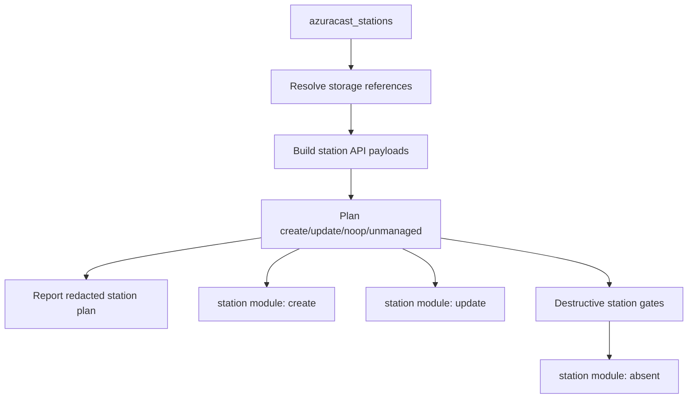
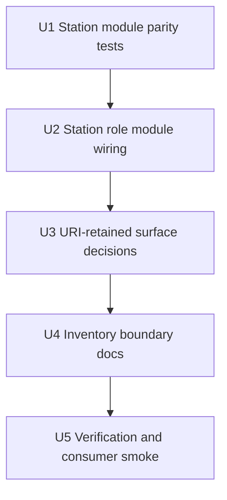

# feat: Finish AzuraCast Resource Module Role Integration

## Summary

Finish the resource-module migration only for the resources already in the
collection's supported inventory: storage locations, stations, station mounts,
station playlists, station remotes, and station webhooks. The remaining active
implementation work is to move `roles/stations` onto the existing `station`
module, then codify that settings, API preflight/OpenAPI discovery, and storage
credential rotation intentionally remain `uri`-based paths.

---

## Problem Frame

The collection already has resource modules and role integration for storage
locations and station-scoped resources, but `roles/stations` still mutates
stations through raw `ansible.builtin.uri` tasks. That leaves one core resource
family outside the new shared module reconciliation path and keeps several
module-scope questions implicit instead of documented.

---

## Assumptions

*This plan was authored without a synchronous scope-confirmation step. The
items below are agent inferences that should be reviewed before implementation
proceeds.*

- The existing `station` module interface is stable enough for role integration;
  remaining work should harden parity tests rather than redesign it.
- Settings, API preflight/OpenAPI discovery, and storage credential rotation
  should remain `uri`-based unless implementation finds a concrete safety or UX
  regression that a module would solve.
- The current inventory scope is intentionally bounded to settings, storage
  locations, stations, mounts, playlists, remotes, and webhooks.
- Consumer verification should use the local vendored collection workflow and
  should not push this branch or publish artifacts.

---

## Requirements

- R1. Integrate `roles/stations` with `fculpo.azuracast_api.station` for safe
  create, update, and delete paths.
- R2. Preserve station storage-reference resolution before station writes.
- R3. Preserve exclusion of station-scoped child arrays from station create and
  update payloads.
- R4. Preserve destructive delete gates for stations.
- R5. Preserve module-native check-mode behavior for station create, update,
  and delete operations.
- R6. Decide and document that settings remain `uri`-based for now.
- R7. Decide and document that API preflight and OpenAPI discovery remain
  `uri`-based orchestration checks.
- R8. Decide and document that storage credential rotation remains the explicit
  tagged `uri` path.
- R9. Identify missing resource modules only against the collection's current
  inventory scope; do not expand into broad AzuraCast OpenAPI coverage.
- R10. Include collection-local tests, module docs/readme updates, sanity/build
  checks, and consumer smoke verification.
- R11. Do not push.

---

## Scope Boundaries

- Do not add a `settings` module in this plan.
- Do not add an API preflight or OpenAPI discovery module in this plan.
- Do not add a storage credential rotation module action in this plan.
- Do not add resource modules for AzuraCast users, API keys, roles,
  permissions, media, podcasts, streamers, broadcasts, relays beyond existing
  remotes, reports, or operational actions.
- Do not change the public variable model for `azuracast_stations`.
- Do not replace whole-instance role planning with module-only loops; roles
  continue to build and report plans before mutation tasks run.
- Do not remove the final consumer smoke path, but keep it as verification only.
- Do not push or publish from this work.

### Deferred to Follow-Up Work

- New resource modules requested by actual inventory needs: evaluate with the
  criteria in `docs/module-feasibility.md`, not by walking the whole OpenAPI
  document.
- A dedicated settings module: reconsider only if users need direct settings
  tasks with native module results or if the settings role grows beyond simple
  singleton convergence.
- A dedicated credential-rotation module action: reconsider only if the tagged
  role path becomes difficult to audit or safely document.

---

## Context & Research

### Relevant Code and Patterns

- `plugins/modules/station.py`: existing station module matched by
  `short_name`; excludes station-scoped child arrays and resolves storage
  references before mutation.
- `plugins/module_utils/azuracast_resources.py`: shared resource reconciliation
  for create/update/delete, diff shaping, check mode, and OpenAPI validation.
- `plugins/module_utils/azuracast_planning.py`: shared desired-shape,
  sensitive-field, station-payload, storage-reference, and role-plan helpers.
- `roles/storage/tasks/main.yml`: current role pattern for keeping planning in
  the role and delegating safe create/update/delete to `storage_location`.
- `roles/station_resources/tasks/main.yml`: current role pattern for station
  resource planning plus module-backed safe create/update/delete per family.
- `roles/stations/tasks/main.yml`: remaining raw `uri` station mutation path.
- `roles/settings/tasks/main.yml`: singleton settings role that fetches live
  state, resolves storage references, compares only declared fields, and PUTs
  only when drift exists.
- `roles/api/tasks/main.yml`, `roles/api/tasks/openapi.yml`, and
  `roles/api/tasks/discover.yml`: orchestration and discovery tasks that are
  checks/exports rather than resource reconciliation.
- `tests/test_storage_role_module_wiring.py` and
  `tests/test_station_resources_role_module_wiring.py`: YAML-structure tests
  that assert roles use modules for safe mutation paths and keep safety gates.

### Institutional Learnings

- `docs/module-feasibility.md` recommends a hybrid strategy: keep roles as the
  high-level interface, introduce modules resource-by-resource, and avoid
  module expansion when it is only a thin `uri` wrapper.
- `docs/module-architecture.md` records the established boundary: modules are
  resource-level; roles remain orchestration-level; OpenAPI validates
  capability but does not generate behavior.
- `docs/api-authority.md` explicitly keeps storage credential rotation as a
  targeted tagged path because write-only fields do not round-trip reliably.
- `docs/plans/2026-05-09-001-feat-module-architecture-plan.md` is completed
  background for the current module architecture. This plan is the follow-up for
  the remaining role integration and scope decisions.

### External References

- Not used. The remaining work applies established in-repo Ansible collection
  patterns and does not require new external framework guidance.

---

## Key Technical Decisions

| Surface | Decision | Rationale |
|---------|----------|-----------|
| Stations | Use the existing `station` module inside `roles/stations` for create, update, and delete. | Stations are a managed resource with a stable key, destructive gates, check-mode needs, and existing module coverage. |
| Settings | Keep `roles/settings` `uri`-based. | Settings are a singleton partial-update surface with no resource identity or delete lifecycle; the current role already handles desired-field comparison and storage references clearly. |
| API preflight/OpenAPI discovery | Keep `roles/api` `uri`-based. | These tasks validate access, fetch a contract, and export discovery data; they are orchestration checks, not resource reconciliation. |
| Storage credential rotation | Keep the explicit tagged `uri` path. | Normal modules intentionally exclude sensitive write-only fields from update drift. A module action would blur the current opt-in safety model. |
| Additional modules | Do not add modules beyond the current inventory scope. | The collection should expand modules when a managed resource family needs direct module UX, not because the OpenAPI document contains endpoints. |

---

## Open Questions

### Resolved During Planning

- Should `roles/stations` use the station module? Yes. It is the remaining core
  managed resource with an implemented module and direct parallels to storage
  role wiring.
- Should settings get a dedicated module now? No. Keep it `uri`-based and
  document the reason.
- Should API preflight/OpenAPI discovery get modules now? No. Keep them
  `uri`-based orchestration tasks.
- Should storage credential rotation become a module action now? No. Preserve
  the explicit tagged `uri` path.
- Are there missing modules inside the current inventory scope? No obvious
  missing resource modules remain after station role integration: storage
  locations, stations, mounts, playlists, remotes, and webhooks have modules.

### Deferred to Implementation

- Exact YAML task names in `roles/stations/tasks/main.yml`: preserve the current
  intent and test by task name, but allow minor wording changes if they make the
  role clearer.
- Whether station role integration reveals a station module bug: fix only bugs
  directly needed for parity with the current role behavior.
- Consumer smoke command details: use the existing consumer repository workflow
  and vendored collection layout at verification time.

---

## High-Level Technical Design

> *This illustrates the intended approach and is directional guidance for
> review, not implementation specification. The implementing agent should treat
> it as context, not code to reproduce.*

The station role should keep its existing planning flow because it gives
operators a whole-instance redacted plan before mutation. Only the mutation
tasks should move from raw `uri` calls to the existing `station` module, matching
the role/module split already used by storage locations and station-scoped
resources.

---

## Implementation Units

### U1. Strengthen Station Module Parity Coverage

**Goal:** Ensure the existing `station` module has explicit coverage for the
behaviors `roles/stations` depends on before the role starts calling it.

**Requirements:** R2, R3, R5

**Dependencies:** None

**Files:**
- Modify: `tests/test_station_module.py`
- Modify if needed: `plugins/modules/station.py`

**Approach:**
- Add focused characterization tests around station payload construction,
  storage-reference handling, and check-mode mutation suppression.
- Prefer fixing small module parity gaps over reshaping the module interface.
- Keep the public module options unchanged unless a test exposes an existing
  mismatch with role behavior.

**Execution note:** Add characterization coverage before changing
`roles/stations/tasks/main.yml`.

**Patterns to follow:**
- `tests/test_storage_location_module.py`
- `tests/test_station_module.py`
- `plugins/modules/station.py`

**Test scenarios:**
- Happy path: desired station with storage reference objects is resolved to live
  storage IDs before create or update.
- Happy path: desired station with `mounts`, `playlists`, `remotes`, and
  `webhooks` produces a station payload without those child arrays.
- Edge case: module `short_name` option and `resource.short_name` mismatch
  raises a planning error before mutation.
- Error path: unknown storage reference type raises a planning error and does
  not create or update.
- Integration: check-mode create, update, and delete return `changed: true`
  with the planned action while leaving the fake client mutation lists empty.

**Verification:**
- Station module tests demonstrate parity with the current role planning
  assumptions.
- No public station module option or return contract changes are needed for role
  wiring.

### U2. Wire `roles/stations` to the Station Module

**Goal:** Replace raw station create, update, and delete `uri` mutation tasks
with `fculpo.azuracast_api.station` while preserving the role's existing plan,
storage resolution, child-resource exclusion, delete gates, and check-mode
reporting behavior.

**Requirements:** R1, R2, R3, R4, R5

**Dependencies:** U1

**Files:**
- Modify: `roles/stations/tasks/main.yml`
- Create: `tests/test_station_role_module_wiring.py`
- Modify if needed: `tests/test_azuracast_api_filters.py`

**Approach:**
- Keep the current live station fetch, live storage fetch, storage-reference
  resolution, station API payload planning, and redacted debug plan.
- Change only mutation tasks for create, update, and allowed delete to call
  `fculpo.azuracast_api.station`.
- Pass `short_name`, `resource`, `state`, `base_url`, `api_key`,
  `validate_certs`, and `timeout` consistently with the storage and
  station-resource roles.
- Let the module handle check mode for station mutations instead of skipping the
  module task with `when: not ansible_check_mode`.
- Preserve the station destructive gate through `azuracast_destructive_deletes`
  with family `stations`.

**Patterns to follow:**
- `roles/storage/tasks/main.yml`
- `roles/station_resources/tasks/main.yml`
- `tests/test_storage_role_module_wiring.py`
- `tests/test_station_resources_role_module_wiring.py`

**Test scenarios:**
- Happy path: "Create missing stations" uses
  `fculpo.azuracast_api.station`, passes `short_name` from the desired station,
  passes the planned resource payload, and sets `state: present`.
- Happy path: "Update changed stations" uses the station module, passes
  `short_name` from the plan key, passes `item.after`, and sets
  `state: present`.
- Happy path: "Delete unmanaged stations only when explicitly allowed" uses the
  station module with `state: absent`.
- Edge case: station mutation tasks do not include a blanket
  `not ansible_check_mode` guard, so module check mode can report planned
  changes.
- Integration: the role still calls storage-reference resolution and station
  child exclusion before plan creation.
- Error path: destructive station deletes still require both
  `azuracast_destructive_sync` and `stations` in `azuracast_destructive_allow`.

**Verification:**
- Role wiring tests prove station create/update/delete use the module and keep
  safety gates.
- Existing station planning filter tests still pass, showing the role's
  planning inputs were not weakened.

### U3. Codify URI-Retained Surfaces

**Goal:** Make the non-module decisions explicit and regression-tested so later
work does not accidentally convert singleton, orchestration, or credential
rotation paths into modules without a new decision.

**Requirements:** R6, R7, R8

**Dependencies:** U2

**Files:**
- Modify: `docs/module-architecture.md`
- Modify: `docs/api-authority.md`
- Modify: `README.md`
- Modify: `tests/test_storage_role_module_wiring.py`
- Create: `tests/test_uri_retained_role_paths.py`

**Approach:**
- Document why settings remain a role-owned singleton `uri` PUT path.
- Document why API preflight, live OpenAPI validation, and sanitized discovery
  remain role-owned `uri` checks/exports.
- Keep the existing storage credential rotation test and extend coverage only if
  needed to assert the tagged `uri` path remains explicit.
- Add lightweight YAML-structure tests for settings and API role tasks so the
  decision is protected by tests rather than just prose.

**Patterns to follow:**
- `tests/test_storage_role_module_wiring.py`
- `roles/settings/tasks/main.yml`
- `roles/api/tasks/main.yml`
- `roles/api/tasks/openapi.yml`
- `roles/api/tasks/discover.yml`

**Test scenarios:**
- Happy path: settings role still fetches settings with `uri`, computes drift
  with filters, and updates via `uri` only when desired fields differ.
- Happy path: API role authentication and OpenAPI validation tasks remain
  `uri`-based checks with `check_mode: false` where live reads are required.
- Happy path: storage credential rotation remains a tagged `uri` update with
  `never` and `storage_rotate_credentials`.
- Edge case: settings storage references remain resolved before the settings
  PUT body is built.
- Error path: API preflight still fails through assertions on unsuccessful
  authentication or unavailable OpenAPI, not through a resource module result.

**Verification:**
- Documentation states the intentional URI-retained surfaces and the safety
  rationale.
- Tests protect the current role boundaries from accidental module expansion.

### U4. Confirm the Bounded Module Inventory

**Goal:** Identify the missing-module answer for the current inventory scope
and update docs so contributors do not treat the AzuraCast OpenAPI document as a
module backlog.

**Requirements:** R9

**Dependencies:** U3

**Files:**
- Modify: `README.md`
- Modify: `docs/module-feasibility.md`
- Modify: `docs/module-architecture.md`
- Modify if needed: `examples/station.yml`

**Approach:**
- State that, after station role integration, no additional resource modules
  are required for the current managed inventory scope.
- Keep current exclusions visible: users, roles, API keys, media, operational
  broadcast actions, and other broad OpenAPI endpoints remain outside scope.
- Update station examples only if the role integration reveals outdated module
  usage or wording.
- Avoid adding docs that imply comprehensive AzuraCast API coverage.

**Patterns to follow:**
- `README.md` "Current Limitations"
- `docs/module-feasibility.md` "Decision Criteria"
- `docs/module-architecture.md` "Current Modules"

**Test scenarios:**
- Test expectation: none -- this is documentation and scope clarification.

**Verification:**
- Docs clearly distinguish the supported inventory scope from broader AzuraCast
  API coverage.
- The module list and role list stay consistent across README and architecture
  docs.

### U5. Run Final Verification and Consumer Smoke

**Goal:** Verify the completed plan through collection-local unit tests,
Ansible sanity/build checks, and the existing consumer check-mode smoke path
without pushing.

**Requirements:** R10, R11

**Dependencies:** U1, U2, U3, U4

**Files:**
- Modify if needed: `README.md`
- Modify if needed: `docs/module-architecture.md`

**Approach:**
- Use `uv run pytest -q` as the primary local unit test command.
- Run module documentation and collection sanity/build checks from a temporary
  collection layout, matching the verification pattern already used on this
  branch.
- Install or vendor the local collection artifact into the consumer repository
  workflow and run the consumer check-mode smoke against the vendored
  collection.
- Keep consumer verification read-only/check-mode unless the user explicitly
  authorizes a real converge.
- Do not push.

**Patterns to follow:**
- `docs/module-architecture.md` "Collection-Local Verification"
- `README.md` "Local Development"
- Existing consumer repository vendored collection workflow

**Test scenarios:**
- Integration: collection-local unit tests pass with the new role wiring and
  URI-retained-path tests.
- Integration: Ansible sanity passes from a temporary collection layout.
- Integration: collection build produces an installable artifact.
- Integration: consumer check-mode run completes with `changed=0 failed=0` when
  the target inventory is already converged.
- Error path: if consumer smoke fails, capture whether the failure is collection
  packaging, consumer vendoring, inventory drift, or live API behavior before
  changing code.

**Verification:**
- `uv run pytest -q` passes.
- `ansible-test sanity` passes from the temporary collection layout.
- Collection build succeeds.
- Consumer check-mode smoke against the vendored collection reports no failures.
- No push is performed.

---

## System-Wide Impact

- **Interaction graph:** `roles/stations` will align with `roles/storage` and
  `roles/station_resources` by using modules only for mutation while retaining
  role-level plan reporting.
- **Error propagation:** station module planning or API failures should surface
  as module failures during mutation tasks; pre-mutation role planning failures
  should continue to surface through filters/assertions.
- **State lifecycle risks:** station deletes remain high-impact and must stay
  behind both destructive gates. Stations should remain late in the recommended
  delete rollout order.
- **API surface parity:** module and role behavior should agree on station
  storage references, child-resource exclusion, sensitive-field handling, and
  check mode.
- **Integration coverage:** YAML-structure tests prove role wiring, but the
  consumer check-mode smoke is still needed to prove the packaged collection is
  wired correctly in the downstream playbook.
- **Unchanged invariants:** role variable names, desired-state shape, module
  public options, API preflight behavior, settings convergence, and storage
  credential rotation safety remain unchanged.

---

## Risks & Dependencies

| Risk | Mitigation |
|------|------------|
| Station module behavior differs subtly from the old station role `uri` path. | Add characterization tests before role wiring and keep the old planning filters in the role. |
| Check mode becomes less informative if mutation tasks are skipped instead of delegated to modules. | Assert station module mutation tasks do not carry blanket `not ansible_check_mode` guards. |
| Station deletes become easier to trigger accidentally. | Preserve `azuracast_destructive_deletes` and the `stations` allow-list gate. |
| Settings or preflight get converted to modules because "everything should be a module." | Document and test the URI-retained decisions explicitly. |
| Scope creeps into broad AzuraCast API coverage. | Keep current inventory scope in README and architecture docs; defer other resources until real inventory needs exist. |
| Consumer smoke failure is caused by live inventory drift rather than collection code. | Treat consumer smoke as diagnostic; classify the failure before changing collection behavior. |

---

## Documentation / Operational Notes

- Update README and architecture docs after role integration so they describe
  the final hybrid model: roles for whole-instance convergence, modules for
  resource-level mutation.
- Keep `docs/api-authority.md` aligned with the final storage credential
  rotation decision.
- Mention no new release publishing or push step in verification notes.
- Consumer verification should remain a final smoke, not a prerequisite for
  every small local test run.

---

## Sources & References

- Related plan: `docs/plans/2026-05-09-001-feat-module-architecture-plan.md`
- Architecture: `docs/module-architecture.md`
- Feasibility criteria: `docs/module-feasibility.md`
- API safety model: `docs/api-authority.md`
- Station module: `plugins/modules/station.py`
- Shared reconciler: `plugins/module_utils/azuracast_resources.py`
- Planning helpers: `plugins/module_utils/azuracast_planning.py`
- Station role: `roles/stations/tasks/main.yml`
- Storage role module wiring tests: `tests/test_storage_role_module_wiring.py`
- Station resource role module wiring tests:
  `tests/test_station_resources_role_module_wiring.py`
